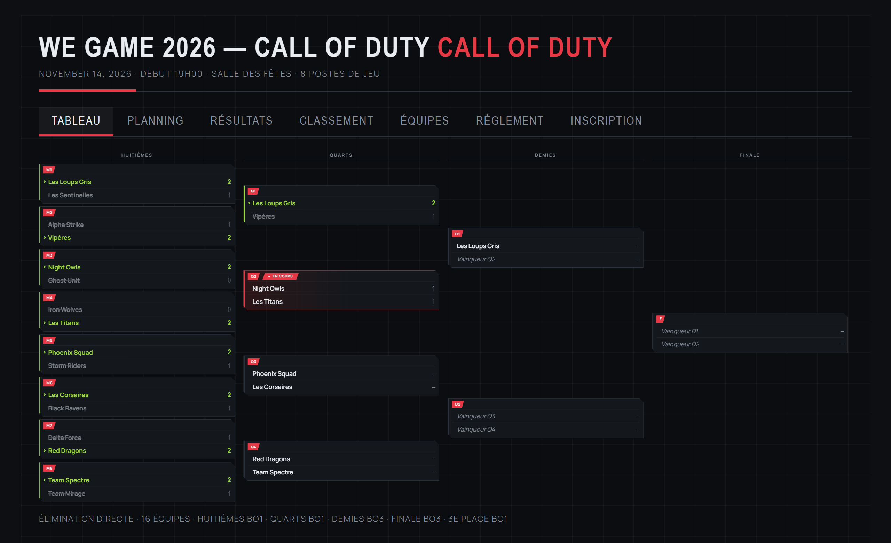
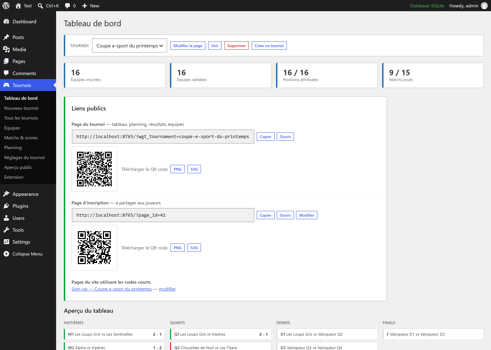
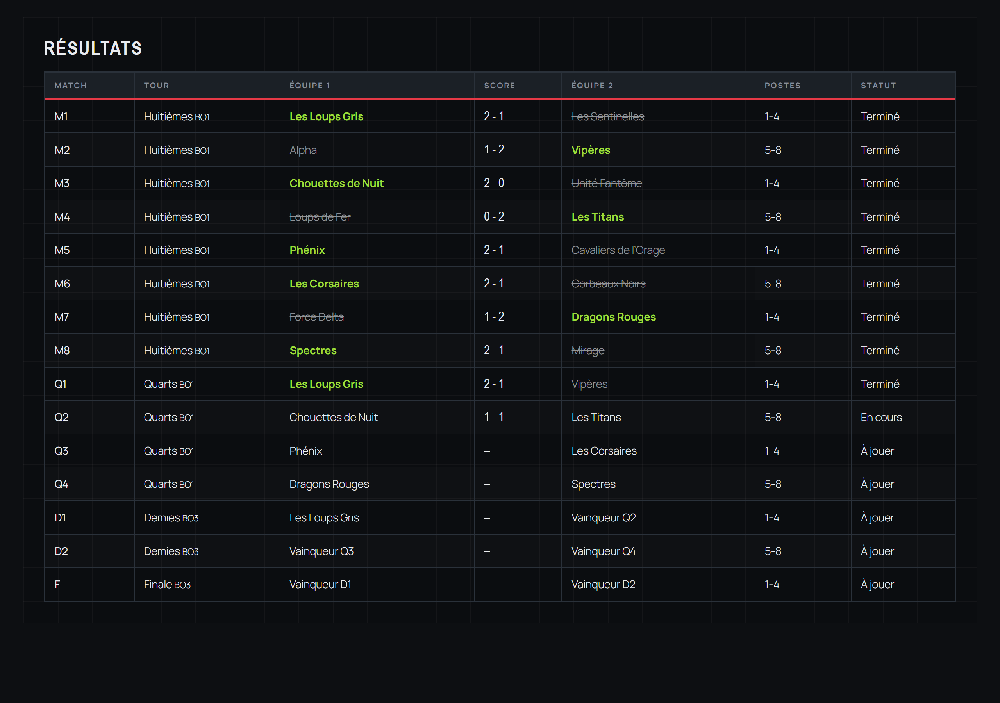
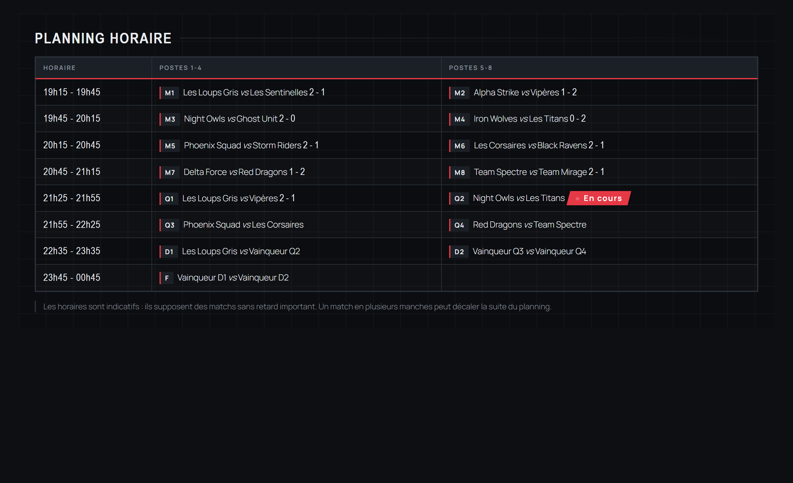

<div align="center">

# We Game Tournoi

**Organiser et diffuser un tournoi e-sport depuis WordPress.**

De 2 à 64 équipes, en élimination directe, double élimination ou phase de poules.
Le tableau, le planning et les résultats s'affichent sur une page publique qui se met à jour toute seule pendant la soirée.

[](https://github.com/cparfait/wordpress-tournois/releases)
[](https://wordpress.org/)
[](https://www.php.net/)
[](LICENSE)
[](wegame-tournoi/languages)

[Documentation](https://cparfait.github.io/wordpress-tournois/) · [Téléchargement](https://github.com/cparfait/wordpress-tournois/releases/latest) · [Signaler un problème](https://github.com/cparfait/wordpress-tournois/issues)

</div>



---

## Sommaire

- [Pourquoi cette extension](#pourquoi-cette-extension)
- [Fonctionnalités](#fonctionnalités)
- [Installation](#installation)
- [Démarrage rapide](#démarrage-rapide)
- [Les trois formats](#les-trois-formats)
- [Partager le tournoi](#partager-le-tournoi)
- [Codes courts](#codes-courts)
- [API REST](#api-rest)
- [Mises à jour automatiques](#mises-à-jour-automatiques)
- [Compatibilité](#compatibilité)
- [Structure du code](#structure-du-code)
- [Vie privée](#vie-privée)
- [Licence et crédits](#licence-et-crédits)

---

## Pourquoi cette extension

Elle a été écrite pour **We Game 2026**, un tournoi à 16 équipes sur 8 postes de jeu. Le besoin était simple et mal couvert par les outils existants : afficher le tableau sur un écran et sur les téléphones des joueurs, saisir les scores sans se tromper, et ne pas dépendre d'un service en ligne.

Elle gère aujourd'hui plusieurs tournois par site, dans trois formats, avec ou sans inscriptions publiques.

**Trois choses, bien faites :**

1. **Générer le tableau** à partir du format et du nombre d'équipes, exemptions comprises.
2. **Propager les résultats** que vous saisissez, et invalider ce qui en dépendait si vous corrigez.
3. **Publier le tout** sur une page que les joueurs consultent depuis leur téléphone.

---

## Fonctionnalités

### Formats et tableau

- **Élimination directe**, **double élimination** (repêchage, grande finale, seconde grande finale optionnelle) et **phase de poules** suivie d'un tableau final.
- **2 à 64 équipes.** Quand l'effectif n'est pas une puissance de deux, les mieux placées sont exemptées du premier tour ; ces exemptions n'occupent ni créneau ni poste.
- **Placement par tête de série** selon l'algorithme classique. Pour 16 équipes : `1-16`, `8-9`, `4-13`, `5-12`, `2-15`, `7-10`, `3-14`, `6-11`.
- **Manches réglables par tour** : BO1, BO3 ou BO5, saisie manche par manche.
- **Qualifiés croisés entre poules** : deux équipes d'une même poule ne se croisent pas au premier tour de la phase finale, et les premiers de poule pas avant la finale.
- **Match pour la 3e place** et **classement général** de la première à la dernière place.

### Le jour J

- **Propagation automatique** du vainqueur au tour suivant et du perdant au repêchage.
- **Invalidation en cascade** : corriger un résultat remet à zéro tout ce qui en dépendait.
- **Contrôles de saisie** : un match nul, une manche à égalité ou des manches en trop sont refusés avec un message explicite.
- **Planning calculé** par tour, en tenant compte des matchs simultanés, des manches et des pauses ; les horaires ajustés à la main ne sont pas écrasés.
- **Rafraîchissement automatique** de la page publique, en pause quand l'onglet est en arrière-plan, avec espacement des tentatives en cas de coupure réseau.

### Inscriptions et diffusion

- **Formulaire public** facultatif, complet ou réduit à *Team, Pseudo, Mail, Téléphone*.
- **Validation par l'organisation** : les demandes n'apparaissent pas dans le tableau avant d'être validées.
- **Accusé de réception** au capitaine et alerte à l'organisation.
- **QR codes** de la page du tournoi et de la page d'inscription, téléchargeables en PNG ou SVG, calculés par votre propre serveur.
- **Page d'inscription dédiée** créée en un clic.

### Administration

- **Assistant de création** en quatre étapes, avec récapitulatif et estimation de l'heure de fin.
- **Plusieurs tournois** par site, chacun avec sa page, ses équipes et ses réglages.
- **Duplication** d'un tournoi pour préparer l'édition suivante.
- **Sauvegarde et restauration JSON**, transactionnelle.
- **Aperçu public** intégré, en largeur bureau, tablette ou mobile.

---

## Installation

### Depuis l'archive

1. Téléchargez `wegame-tournoi-2.5.0.zip` depuis la [dernière version](https://github.com/cparfait/wordpress-tournois/releases/latest).
2. Dans WordPress : **Extensions → Ajouter → Téléverser une extension**.
3. Activez. Un menu **Tournois** apparaît.

> [!IMPORTANT]
> **Deux archives sont publiées, ne les confondez pas.**
>
> | Archive | Pour quoi |
> |---|---|
> | `wegame-tournoi-2.5.0.zip` | **Installation sur un site.** Contient les mises à jour automatiques par manifeste. |
> | `wegame-tournoi-2.5.0-POUR-WORDPRESS-ORG.zip` | **Uniquement pour soumettre au répertoire WordPress.org.** Le module de mise à jour en est retiré, car le règlement l'interdit. |
>
> L'outil *Plugin Check* signalera toujours un `plugin_updater_detected` sur la première : c'est normal et sans conséquence tant que vous ne soumettez pas au répertoire. C'est la seconde qu'il faut installer pour vérifier le paquet de soumission.


### Depuis les sources

```bash
git clone https://github.com/cparfait/wordpress-tournois.git
cp -r wordpress-tournois/wegame-tournoi /chemin/vers/wp-content/plugins/
```

Puis activez l'extension dans WordPress.

> [!TIP]
> Si vous comptez ouvrir les inscriptions, testez l'envoi des e-mails avant la soirée : **Tournois → Extension → Envoyer un e-mail de test**. Beaucoup d'hébergements n'expédient rien sans configuration SMTP.

> [!NOTE]
> Si les pages de tournoi renvoient une erreur 404, ouvrez **Réglages → Permaliens** et cliquez sur Enregistrer sans rien changer.

---

## Démarrage rapide

**Tournois → Nouveau tournoi** ouvre un assistant en quatre étapes.

| Étape | Ce que vous renseignez |
|---|---|
| 1. Le tournoi | Nom, jeu, lieu, date, heure du premier match, couleur |
| 2. Le format | Format, nombre d'équipes, poules, options de finale |
| 3. Matchs et horaires | Manches par tour, postes, matchs simultanés, durées, pauses |
| 4. Inscriptions et publication | Formulaire public, page publiée, en brouillon ou absente |

Ensuite, le tableau de bord affiche un panneau **Prochaines étapes** qui vous guide jusqu'au jour J :

1. Constituer les équipes, à la main ou en validant les inscriptions reçues.
2. Attribuer les positions, une par une ou par tirage au sort.
3. Vérifier la page publique et partager son lien ou son QR code.
4. Le jour J, saisir les scores dans **Matchs & scores**.



---

## Les trois formats

Les chiffres valent pour **16 équipes**.

| Format | Matchs | Une équipe joue | Pour qui |
|---|---:|---:|---|
| Élimination directe | 15 | 1 à 4 | Une soirée courte, beaucoup d'équipes |
| Double élimination | 30 ou 31 | 2 à 8 | Un tournoi qui ne se joue pas sur un accident |
| Poules puis tableau | 24 + 7 | 3 à 5 | Quand personne ne doit repartir après un seul match |

Le principal levier sur la durée n'est pas le nombre d'équipes mais le **nombre de manches** : un BO3 occupe environ deux fois le créneau d'un BO1.



---

## Partager le tournoi

Le tableau de bord affiche un bloc **Liens publics** avec, pour chaque adresse, un bouton Copier et un QR code téléchargeable.

| | Sert à |
|---|---|
| **Page du tournoi** | Tableau, planning, résultats, équipes, classement. À afficher sur un écran et à partager au public. |
| **Page d'inscription** | Une page courte ne contenant que le formulaire. À mettre sur une affiche avant l'événement. |

Les QR codes sont **calculés par votre serveur** : aucune adresse n'est transmise à un service extérieur, et ils s'affichent sans JavaScript. Ils se téléchargent en PNG d'environ 600 pixels de côté ou en SVG vectoriel.



---

## Codes courts

Créez une page dans **Pages → Ajouter**, collez-y le code court, puis **Publiez**.

| Code court | Affichage |
|---|---|
| `[wegame_tournoi]` | Page complète à onglets |
| `[wegame_tableau]` | Le tableau des matchs seul |
| `[wegame_planning]` | Le planning horaire |
| `[wegame_resultats]` | La feuille de résultats |
| `[wegame_classement]` | Le classement général |
| `[wegame_poules]` | Les classements de poules |
| `[wegame_equipes]` | Les équipes engagées |
| `[wegame_inscription]` | Le formulaire d'inscription |
| `[wegame_reglement]` | Le règlement |
| `[wegame_organisation]` | Le personnel nécessaire |
| `[wegame_checklist]` | La checklist avant ouverture |
| `[wegame_tournois]` | La liste des tournois du site |

### Attributs

| Attribut | Sur | Effet |
|---|---|---|
| `tournoi="identifiant"` | tous sauf `[wegame_tournois]` | Cible un tournoi précis. Sans lui : le tournoi de la page, sinon celui par défaut. |
| `simple="yes"` | `[wegame_inscription]` | Formulaire réduit à Team, Pseudo, Mail, Téléphone |
| `header="no"` | `[wegame_tableau]` | Masque le bandeau de titre (écran de régie) |
| `fit="width"` | `[wegame_tableau]`, `[wegame_tournoi]` | Ajuste à la largeur seulement, avec défilement vertical |
| `players="yes"` | `[wegame_equipes]` | Affiche la composition des équipes |

```
[wegame_tableau tournoi="we-game-2026" header="no" fit="width"]
```

---

## API REST

Deux routes publiques, en lecture seule.

| Route | Renvoie |
|---|---|
| `GET /wp-json/wegame/v1/state` | L'état complet du tournoi en JSON |
| `GET /wp-json/wegame/v1/render?view=bracket` | Le HTML d'une vue |

Les deux acceptent un paramètre `tournament` (identifiant ou slug). Les tournois en brouillon, privés ou sans page dédiée ne sont jamais exposés aux visiteurs.

```bash
curl https://exemple.fr/wp-json/wegame/v1/state?tournament=we-game-2026
```

---

## Mises à jour automatiques

L'extension n'étant pas publiée sur l'annuaire WordPress.org, les mises à jour passent par un **manifeste auto-hébergé** dont vous indiquez l'adresse dans **Tournois → Extension**. WordPress propose ensuite la mise à jour comme pour n'importe quelle autre extension.

```json
{
  "name": "We Game Tournoi",
  "slug": "wegame-tournoi",
  "version": "2.5.0",
  "requires": "5.6",
  "requires_php": "7.0",
  "download_url": "https://exemple.fr/maj/wegame-tournoi-2.5.0.zip",
  "sha256": "empreinte hexadécimale du fichier ZIP"
}
```

**Un manifeste prêt à l'emploi est déjà publié** pour ce dépôt. Collez cette adresse dans Tournois → Extension → URL du manifeste :

```
https://cparfait.github.io/wordpress-tournois/manifest.json
```

Il est servi en HTTPS par GitHub Pages, pointe vers la dernière archive publiée en release et porte l'empreinte SHA-256 du paquet. WordPress proposera alors chaque nouvelle version depuis la page Extensions, sans aucun hébergement à prévoir.

Voir [`wegame-tournoi-manifest.json`](wegame-tournoi-manifest.json) pour le fichier source.

> [!IMPORTANT]
> Le manifeste **et** l'archive doivent être servis en HTTPS ; l'extension refuse toute autre adresse. Il s'agit de code PHP installé automatiquement sur votre site.
>
> La clé `sha256` est facultative. Renseignée, elle fait vérifier l'empreinte de l'archive avant installation.

---

## Langues

L'extension est **traduisible intégralement**. Les chaînes source sont en anglais et une traduction française complète est livrée avec elle.

| | |
|---|---|
| Anglais | langue source, aucune traduction à charger |
| Français | 550 chaînes, livrées dans `wegame-tournoi/languages/` |
| Autre langue | déposez un fichier `wegame-tournoi-<code>.mo` dans ce dossier, il apparaît aussitôt dans la liste |

Le réglage **Langue**, dans Tournois puis Extension, choisit la langue de l'extension indépendamment de celle du site : identique au site, anglais, ou l'une des traductions installées. Un message après l'activation y renvoie.

Pour traduire, partez du catalogue `wegame-tournoi/languages/wegame-tournoi.pot`.

---

## Compatibilité

| | |
|---|---|
| WordPress | 5.6 minimum, testé jusqu'à 7.1 |
| PHP | 7.0 minimum, testé jusqu'à 8.3 |
| Base de données | MySQL ou MariaDB. Trois tables préfixées `wgt_`. |
| Thèmes | Indépendant du thème. Le bandeau de titre est masqué sur les pages de tournoi, avec une liste de sélecteurs extensible. |
| Dépendances | Aucune. Ni bibliothèque JavaScript externe, ni service en ligne, ni clé d'API. |
| Langues | Anglais et français livrés ; traduisible dans toute autre langue, domaine `wegame-tournoi`. |

---

## Structure du code

```
wegame-tournoi/
├── wegame-tournoi.php          Amorçage, constantes, chargement des assets
├── uninstall.php               Désinstallation (ne supprime rien par défaut)
├── includes/
│   ├── class-wgt-tournament.php  Type de contenu, réglages par tournoi
│   ├── class-wgt-install.php     Tables, migrations, permaliens
│   ├── class-wgt-bracket.php     Génération de la structure et du planning
│   ├── class-wgt-data.php        Accès aux données, propagation des résultats
│   ├── class-wgt-standings.php   Classements de poules et classement général
│   ├── class-wgt-qr.php          Générateur de QR code (mode octets, niveau M)
│   ├── class-wgt-render.php      Rendu HTML des vues publiques
│   ├── class-wgt-shortcodes.php  Codes courts
│   ├── class-wgt-rest.php        Routes REST
│   ├── class-wgt-registration.php Formulaire public, anti-abus, e-mails
│   ├── class-wgt-io.php          Export et import JSON
│   ├── class-wgt-updater.php     Mises à jour par manifeste
│   ├── class-wgt-theme.php       Intégration au thème
│   ├── class-wgt-settings.php    Réglages communs au site
│   └── class-wgt-admin.php       Écrans d'administration
└── assets/                      CSS et JavaScript, front et admin
```

**Quelques points d'implémentation :**

- La structure d'un tournoi est décrite par des **sources symboliques** (`S3` pour la tête de série 3, `W:M1` pour le vainqueur du match M1, `L:M1` pour son perdant, `G:2:1` pour le premier de la poule B). Le moteur les résout dans un ordre topologique, ce qui rend les formats interchangeables sans code spécifique.
- Les **exemptions** sont détectées récursivement : le perdant d'un match d'exemption n'existe pas, et un match dont les deux sources sont vides est sans objet.
- Le **générateur de QR code** est écrit en PHP, sans dépendance. Sa sortie a été validée module par module contre une implémentation de référence sur une série d'adresses de longueurs variées.

---

## Vie privée

Le formulaire d'inscription collecte le nom de l'équipe, celui du capitaine, une adresse e-mail, un téléphone et éventuellement les pseudonymes des joueurs.

- Le **nom du capitaine** est affiché publiquement sur la page des équipes, ainsi que les joueurs si l'option est activée. L'e-mail et le téléphone ne le sont jamais.
- L'acceptation du règlement est exigée à l'inscription, mais **sa date n'est pas conservée**.
- Les données restent **sur votre serveur**. L'extension ne contacte aucun service extérieur, hormis l'adresse du manifeste de mise à jour si vous en renseignez une.
- Par défaut, **désinstaller l'extension ne supprime aucune donnée**. La purge complète est une option à cocher au préalable.

Pensez à indiquer aux participants la finalité de la collecte et la durée de conservation.

---

## Licence et crédits

Publié sous [licence GPL v2 ou ultérieure](LICENSE), comme WordPress.

Développé pour **We Game 2026**, un tournoi à 16 équipes sur 8 postes de jeu.

Le [journal des versions](CHANGELOG.md) retrace l'évolution de l'extension depuis la version 1.0.0.
